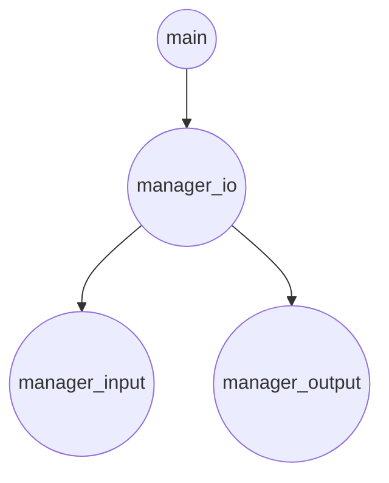
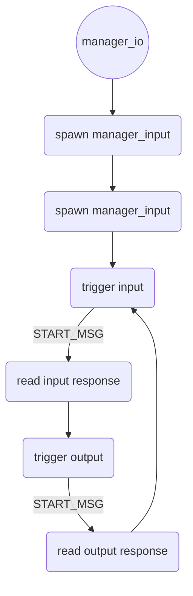

# Welcome to Egg Robotic Arm!
This is an implementation of a multiprocess egg dispenser thought and builded to support interchangable input and output modules.
## Fast project map
|File name  |Description                                               
|----------------|----------
|main.c          |Mainly starts the managers      
|manager_io.c    |Logical manager and middle process between manager_input.c and manager_output.c      
|manager_input.c |Input module
|manager_output.c|Output module
## Installation
For a standard installation we do encourage to download and build the project on your own with the following
```
git clone https://github.com/draane/egg-robotic-arm.git
cd egg-robotic-arm
make
```
The process is thought to be placed as a systemd service and, for the default modules, it should not be started as root, because it is not necessary. Please do see the [DebianWiki](https://wiki.debian.org/systemd/#Creating_or_altering_services) for more information


## How do the processes work (sketch)
**Global program schema**

**manager_io** (more detailed explanation of the protocol  available downward)

