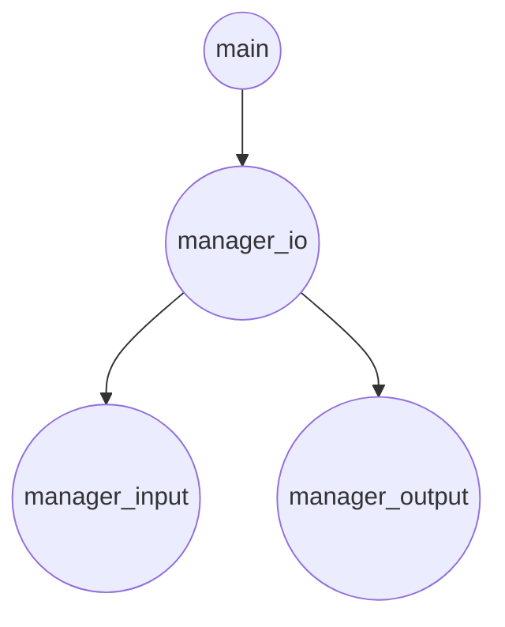
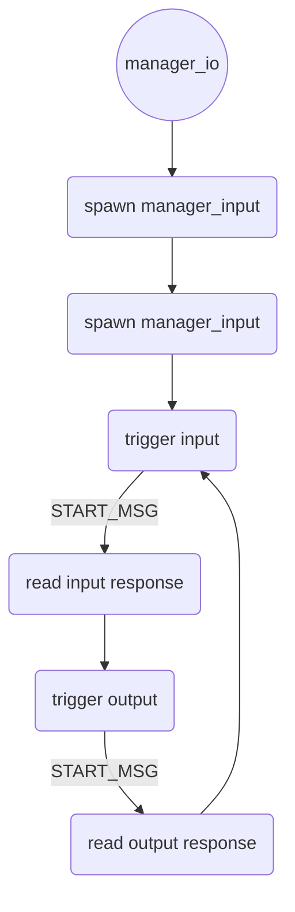
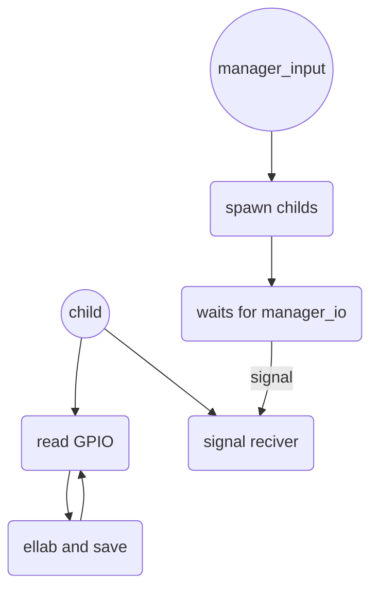

# Welcome to Egg Robotic Arm!
This is an implementation of a multiprocess egg dispenser thought and builded to support interchangable input and output modules.

## Table of contents

You can insert a table of contents using the marker `[TOC]`:

[TOC]
## Fast project map
|File name  |Description                                               
|----------------|----------
|main.c          |Mainly starts the managers      
|manager_io.c    |Logical manager and middle process between manager_input.c and manager_output.c      
|manager_input.c |Input module
|manager_output.c|Output module
## Installation
For a standard installation we do encourage to download and build the project on your own with the following
```
git clone https://github.com/draane/egg-robotic-arm.git
cd egg-robotic-arm
make
```
The process is thought to be placed as a systemd service and, for the default modules, it should not be started as root, because it is not necessary. Please do see the [DebianWiki](https://wiki.debian.org/systemd/#Creating_or_altering_services) for more information


## How do the processes work (sketch)
###**Global program schema**

###**manager_io** 

###**manager_input**

### **manager_output**
//TODO FINISH THIS

## How does communication work
### **General overview**
In general inter process communication between the managers is achieved  via a strict protocol that every module has to comply to. Failing to follow the protocol flow will result in the program closing itself with a non-zero status. The protocol itself is based upon a pipe-based full duplex communication. The creation of the pipes is the manager_io job as better explained further in this document. Every child process expects to recive the content of the START_MSG  macro defined in the utils.h header file. 
>**Note**: The size of the START_MSG **MUST** not exceed the MAX_INFO_TO_SEND_SIZE macro but ignorance of this rule does not lead to failed compilation although will cause the child process to be impossible to trigger.

Once the child process recives the start message the response will be placed in the response pipe. The response is process dependant and it will be further discussed in the following paragraphers
>**Tip:** All the process do follow the standard that states that the pipe 0 is the one from where to read and the pipe 1 is the one where to write but we do encourage to use the READ_PIPE and WRITE_PIPE macros because it makes the code more clean.

### **manager_io**
The manager io basically makes any communication between the others managers possible being the middle process and host of most of the logic. This process has control over the communication flow and it has the job to trigger the managers. The flow is well described in the previous section, the further will focus more on the logic and such than else.
#### **process input**
Once the the input is recived in a char from the input manager it needs to be translated to be parsable by the output manager. Basically the char* is used as a bool array so that the first 6 char are either 'a' ( empty ) or 'b' ( present ) for the egg box sensors. The last 2 chars are the values in the warehouse.
> **Tip:** a and b are not constants, they can be changed in utils.h. Basically they are calculated using the OFFSET_OUTPUT_MSG + ON or OFF macros.
