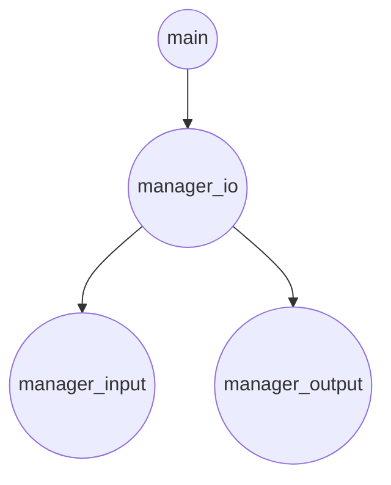
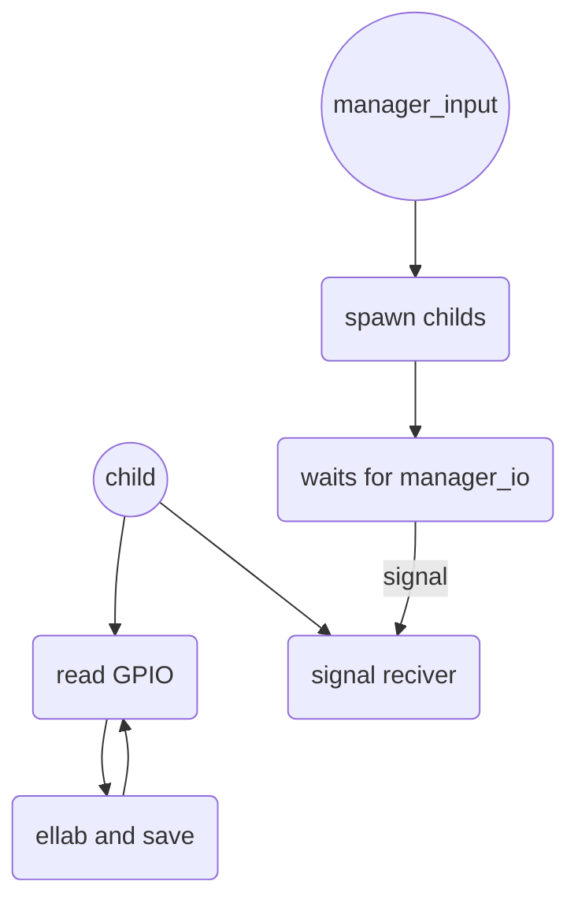

# Welcome to Egg Robotic Arm!
This is an implementation of a multiprocess egg dispenser thought and built to support interchangeble input and output modules.

## Table of contents

You can insert a table of contents using the marker `[TOC]`:

[TOC]
## Fast project map
|File name       |Description                                               
|----------------|----------
|main.c          |Mainly starts the managers and retrieves command line arguments.    
|manager_io.c    |Logical manager and middle process between manager_input.c and manager_output.c      
|manager_input.c |Input module
|manager_output.c|Output module

## Installation
For a standard installation we do encourage to download and build the project on your own with the following
```
git clone https://github.com/draane/egg-robotic-arm.git
cd egg-robotic-arm
make
```
The process is thought to be placed as a systemd service and, for the default modules, it should not be started as root, because it is not necessary. Please do see the [DebianWiki](https://wiki.debian.org/systemd/#Creating_or_altering_services) for more information


## How do the processes work (sketch)
###**Global program schema**

###**manager_io** 
```mermaid
graph TD
A((manager_io)) --> B(spawn manager_input)
B(spawn manager_input) --> E(spawn manager_output)
E(spawn manager_input) --> C(trigger input)
C(trigger input) --START_MSG--> D(read input response)
D(read input response) --> F(trigger output)
F(trigger output) > G(read output response)
G(read output response) --> C(trigger input)
```
###**manager_input**

### **manager_output**
//TODO FINISH THIS

## How does communication work
### **General overview**
In general inter process communication among the managers is achieved  via a strict protocol that every module has to comply to. Failing to follow the protocol flow will result in the program closing itself with a non-zero status. The protocol itself is based upon a pipe-based full duplex communication. The creation of the pipes is the manager_io job as better explained further in this document.
>**Note**: The size of the START_MSG **MUST** not exceed the MAX_INFO_TO_SEND_SIZE macro but ignorance of this rule does not lead to failed compilation although will cause the child process to be impossible to trigger.

Once the child process recives the start message the response will be placed in the response pipe. The response is process dependant and it will be further discussed in the following paragraphs.
>**Tip:** All the processes do follow the standard that states that the pipe 0 is the one from where to read and the pipe 1 is the one where to write but we do encourage to use the READ_PIPE and WRITE_PIPE macros because it makes the code more clean.

### **manager_io**
The manager_io basically makes any communication between the other managers possible being the middle process and host of most of the logic. This process has control over the communication flow and it has the job to trigger the managers. The flow is well described in the previous section, the further will focus more on the logic than else.
#### **process input**
The input is received in a char variable from the input manager's pipe and it needs to be translated into useful data for the output manager. The input message is received as an unsigned char (at least 1 byte size, 1 bit for every boolean sent by input) and parsed into 3 (4 when the robotic arm works) integer variables: eggs in the box (calculated summing the "true" bits among the first six bits sent by the input manager), eggs in the warehouse (parsing the remaining 2 bits as a binary integer), eggs to order (eggs needed to refill the box when the ones in the warehouse aren't enough). The fourth integer would represent the action to be done by the robotic arm, encoding the positions of the eggs to move to the box. 
#### **process output**
The output process needs three integers to light up the proper output LEDs. The integers are written directly through the output pipe without start message, as the output process is idle waiting for three integers (actually 4 ones when the robotic arm is working). The manager_io then remains waiting for the output process to respond positively (the output finish message is set in the constant OUTPUT_FINISHES_MESSAGE as the string "0\0", but can be easily modified when needed). The time the manager_io is working is meant to be used to move the eggs from the warehouse to the box, and the ordered ones to the warehouse. If the robotic arm works, then the time depends entirely on it, otherwise a more rough solution (like moving eggs by hand) must be used, with a manual finish signal such as pushing a "finish button" to resume the manager_io.


> **Tip:** a and b are not constants, they can be changed in utils.h. Basically they are calculated using the OFFSET_OUTPUT_MSG + ON or OFF macros.
### **manager_input**
The following is going to be splitted into two main part because as such the logic of the input manager is divided
#### main part
The main part has the responsibility to set things up and eventually communicate with the manager io when needed. The main part uses pipes to send data to the parent as above described. Into itself, to communicate with the children, pipes and signals are used. When the triggering message is received the main part sends out a signal to his children and then reads the output they provide from the individual pipe that they share.
#### child
In order to make the children as indipendent as possible, given that maybe they could have some heavy interpretation of the input to do, what was build was a system relying on signals to make the polling of the results. This way, once a child has elaborated the input and saved it, it could go on and elaborate the next one without having to waste time waiting for his parent to need it and ask for it. Once the signal is received from the parent, the result of the previous operation is sent to the signal handler.
> **NOTE:** The variable used to save the value is of type integer on most of the systems, because that is the implementation of that type that usually is adopted. That special type is used to ensure that the equal operation is atomic. 
